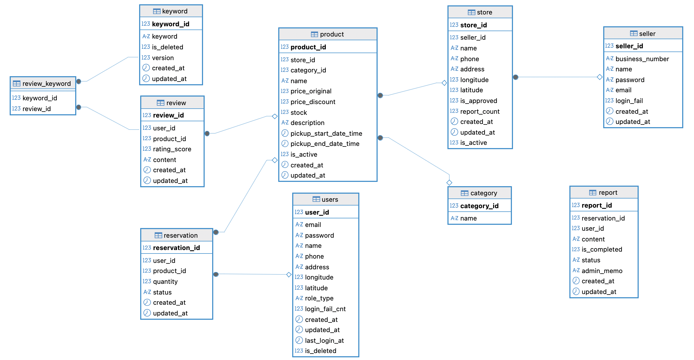

# 🍀 프로젝트 소개 – 럭키 한끼 (Luckyhankki)
럭키 한끼는 위치 기반으로 잉여 음식과 식료품을 예약하고 픽업할 수 있는 공유 플랫폼입니다. 

본 프로젝트는 실제 서비스인 [Too Good To Go](https://www.toogoodtogo.com/)에서 아이디어를 착안하였습니다.

---

## 🛠 기술 스택

📌 Backend
- Java 17
- Spring Boot 3.3
- Spring Security + JWT
- Spring Data JPA + QueryDSL
- Spring Batch
- JUnit 5

⚙️ DevOps & Infra
- Gradle
- Docker
- IntelliJ IDEA
- Git

📦 기타 라이브러리 및 도구
- SpringDoc OpenAPI (Swagger UI 기반 API 문서화)
- JJWT (JWT 토큰 발급/검증)
- DataFaker (더미 데이터 자동 생성)

🗃️ 데이터베이스
- MySQL (개발 환경)
  - Source/Replica 분리로 DB 읽기 성능 최적화
- H2 (테스트 환경)

🧩 도입 예정
- Redis
- 클라우드 배포
- CI/CD

---

## 📑 문서 목록

- [기능 요구사항](docs/FRS.md)
- [유스케이스 시나리오](docs/UsecaseScenario.md)
- [다이어그램](docs/diagram)

---

## 🗃️ ERD



---

## 🏁 프로젝트 시작 안내

### ✅ 조건
- Java 17
- Docker & Docker Compose
- Gradle 8.13

### 🌐 개발 환경 설정
1. 저장소 클론
```text
git clone https://github.com/f-lab-edu/luckyhankki.git
cd luckyhankki/docker
```

2. 인프라 서비스 시작
```text
docker compose up -d
```

3. 애플리케이션 실행
```text
cd ../
./gradlew bootRun
```

4. Swagger UI 접속
```text
http://localhost:8080/swagger-ui/index.html
```

---

## 📘 Swagger 사용 안내

이 프로젝트는 REST API 문서를 Swagger UI를 통해 제공합니다.  
로컬 서버 실행 후 아래 주소에서 확인 가능합니다:

- 🔗 [Swagger UI 바로가기](http://localhost:8080/swagger-ui/index.html)

### Swagger 미리보기


- **상품 API**, **판매자 API**, **유저 API** 등으로 분류되어 있으며,
- 각 항목을 클릭하면 요청/응답 형식과 예제 값을 확인할 수 있습니다.
- "/products", "/categories", "/stores", "/keywords" API는 인증 없이 조회 가능합니다.


- 그 외에는 유저 관련 API에서 회원 가입 및 로그인 후 발급되는 JWT 토큰을 발급받아야 합니다.
- 발급된 토큰을 웹 페이지 상단 Authorize 버튼을 클릭하여 토큰을 Value에 입력 후 Authrozie 버튼을 클릭합니다.

---

## 📌 트러블슈팅

- [테스트 시 Spring Security 인증 객체 주입 오류 해결](https://github.com/f-lab-edu/luckyhankki/wiki/%ED%85%8C%EC%8A%A4%ED%8A%B8-%EC%8B%9C-Spring-Security-%EC%9D%B8%EC%A6%9D-%EA%B0%9D%EC%B2%B4-%EC%A3%BC%EC%9E%85-%EC%98%A4%EB%A5%98-%ED%95%B4%EA%B2%B0)
- [대규모 더미 데이터 생성 시 N+1 문제 해결](https://github.com/f-lab-edu/luckyhankki/wiki/%EB%8C%80%EA%B7%9C%EB%AA%A8-%EB%8D%94%EB%AF%B8-%EB%8D%B0%EC%9D%B4%ED%84%B0-%EC%83%9D%EC%84%B1-%EC%8B%9C-N-1-%EB%AC%B8%EC%A0%9C-%ED%95%B4%EA%B2%B0)
